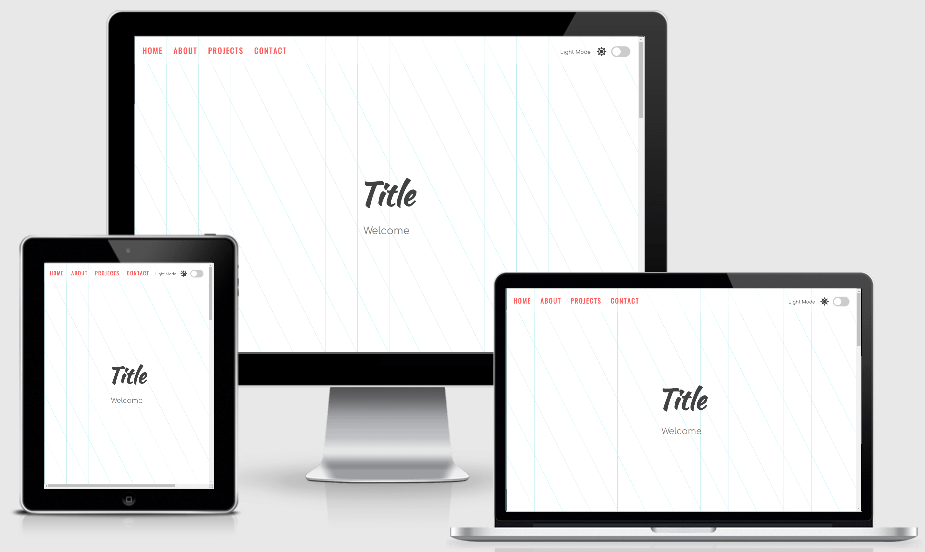

# Light to Dark template

## Overview

- A single page website with a light-to-dark toggle switch. 
- **Objective**: to illustrate how to implement light-to-dark functionality. 

## Technologies

- makes use of `Window.localStorage` to save preference. 

## Credits

### Content

- Color Theme from following article on how to design a dark theme for your android app based on the [Google Material Design Guidelines](https://blog.prototypr.io/how-to-design-a-dark-theme-for-your-android-app-3daeb264637).
- Background Pattern from [Hero Patterns](https://www.heropatterns.com/).
- Illustrations from [unDraw](https://undraw.co/illustrations).
- Icons from [Font Awesome](https://fontawesome.com/).
- Toggle Switch from [w3schools.com](https://www.w3schools.com/howto/howto_css_switch.asp).
